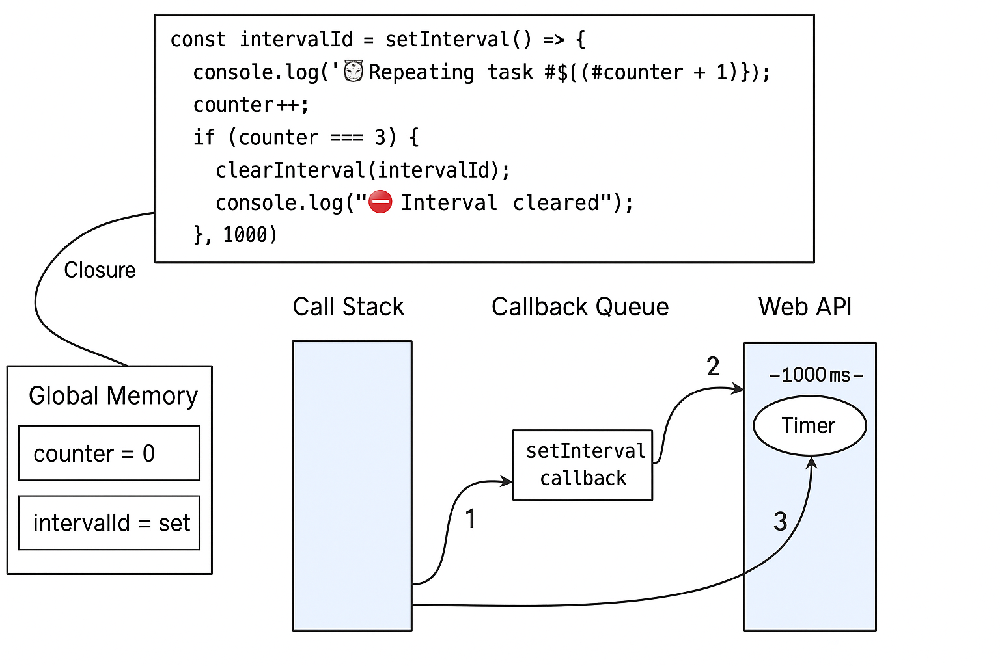

---

## 🧠 setInterval & clearInterval Flow – Visual Diagram

This diagram shows how the JavaScript engine handles setInterval with closures and lexical scope:

- Web API handles the timer.
- Callback Queue collects ready callbacks.
- Event Loop moves them to the Call Stack.
- Closure gives access to `intervalId` inside the callback.
